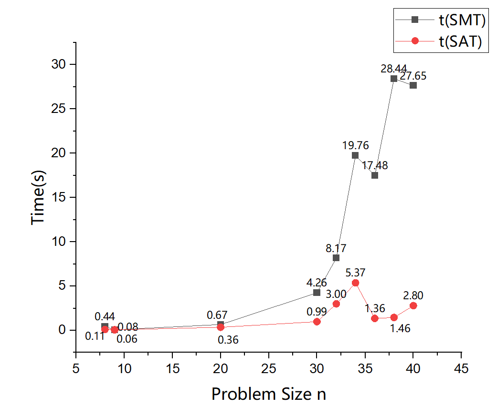
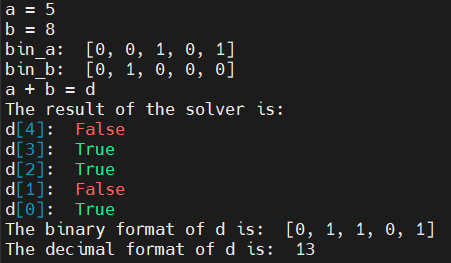
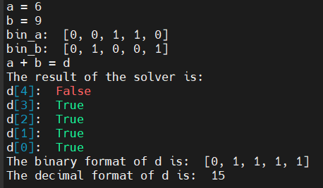
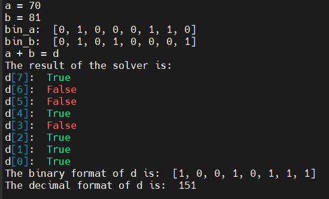
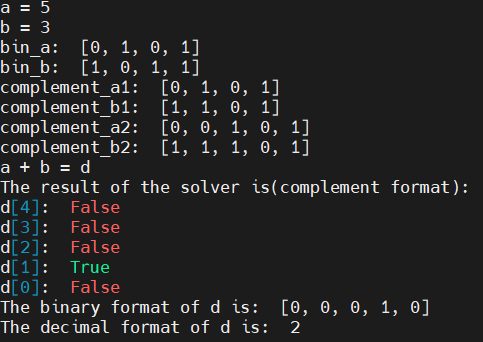
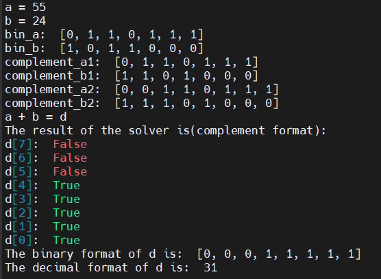
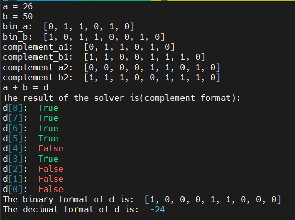

# HW3-实验报告

# Q-1 n皇后

## 1-1 SMT

### 1-1-1 思路

用PPT上的代码，再加上对输入输出的处理即可。

### 1-1-2 代码

```python
from z3 import *
import time

# a solver function for an input n(problem size)
def n_queen_solve(n):
    Q = [ Int("Q_%i" % (i + 1)) for i in range(n) ]
    val_c = [ And (1 <= Q[i], Q[i] <= n) for i in range(n) ]
    col_c = [ Distinct (Q) ]
    diag_c = [ If(i == j, True ,
            And(i+Q[i]!=j+Q[j], i+Q[j]!=j+Q[i]))
            for i in range(n) for j in range(i) ]
    start_time = time.time() # start
    s = Solver()
    s.add(val_c); s.add(col_c); s.add(diag_c)
    if s.check() != sat:
        print("unsatisfiable")
    else: # is sat
        for i in range(n):
            print("Q[{}]: {}".format(i+1, s.model()[Q[i]]))
    print("--- %s seconds ---" % (time.time() - start_time)) # end


# handle input and count time
if __name__=="__main__":
    str = input("Enter the size of the problem: ")
    problem_size = int(str)
    n_queen_solve(problem_size)
```

### 1-1-3 正确性验证

1. n=8时：

```bash
Q[1]: 4
Q[2]: 2
Q[3]: 8
Q[4]: 6
Q[5]: 1
Q[6]: 3
Q[7]: 5
Q[8]: 7
```

2. n=9时：

```bash
Q[1]: 3
Q[2]: 1
Q[3]: 7
Q[4]: 5
Q[5]: 8
Q[6]: 2
Q[7]: 4
Q[8]: 6
Q[9]: 9
```

容易验证，这两个输出都是合法的

## 1-2 Pure SAT

### 1-2-1 思路

定义约束条件：

1. 行约束

$$
\land_{i=1}^n(\lor_{j=1}^n p_{ij})\ \land\ \land_{i=1}^n(\land_{0<j<k\leq n} (\lnot p_{ij} \lor \lnot p_{ik}))
$$

2. 列约束

$$
\land_{j=1}^n(\lor_{i=1}^n p_{ij})\ \land\ \land_{j=1}^n(\land_{0<i<k\leq n} (\lnot p_{ij} \lor \lnot p_{kj}))
$$

3. 对角线约束

$$
\land_{0<i<i'\leq n}(\land_{j,j':i+j=i'+j' \lor i-j=i'-j'} \lnot p_{ij} \lor \lnot p_{i'j'})
$$

### 1-2-2 代码

```python
from z3 import *
import time
# preparation
n = int(input("n is the size of the problem, n = "))
bool_p = []
for i in range(n):
    bool_p_j = [Bool('P_%s_%s' %(i+1, j+1)) for j in range(n)]
    bool_p.append(bool_p_j)

# define constraints
## constraints for rows
row_cons1 = True
for i in range(n):
    row_j = Or(bool_p[i])
    row_cons1 = And(row_cons1, row_j)
row_cons2 = True
for i in range(n):
    row_j = True
    for k in range(n):
        for j in range(k):
            row_j = And(row_j, Or(Not(bool_p[i][j]), Not(bool_p[i][k])))
    row_cons2 = And(row_cons2, row_j)
row_cons = And(row_cons1, row_cons2)
## constraints for columns
col_cons1 = True
for j in range(n):
    col_i = True
    for i in range(n):
        col_i = Or(col_i, bool_p[i][j])
    col_cons1 = And(col_cons1, col_i)
col_cons2 = True
for j in range(n):
    col_i = True
    for k in range(n):
        for i in range(k):
            col_i = And(col_i, Or(Not(bool_p[i][j]), Not(bool_p[k][j])))
    col_cons2 = And(col_cons2, col_i)
col_cons = And(col_cons1, col_cons2)
## constraints for diagonal
diag_cons = True
for i_0 in range(n):
    for i in range(i_0):
        for j_0 in range(n):
            for j in range(n):
                if (i+j == i_0+j_0) or (i-j == i_0-j_0):
                    diag_cons = And(diag_cons, Or(Not(bool_p[i][j]), Not(bool_p[i_0][j_0])))

# solve the problem
start_time = time.time() # start
s = Solver()
s.add(row_cons); s.add(col_cons); s.add(diag_cons)
if s.check() != sat:
    print("unsatisfiable")
else: # is sat
    print("sat!")
    for i in range(n):
        for j in range(n):
            if s.model()[bool_p[i][j]]: # a queen
                print("Q[{}]: {}".format(i+1, j+1))
                break
print("--- %s seconds ---" % (time.time() - start_time)) # end
```


### 1-2-3 正确性验证

1. n=8时：

```bash
Q[1]: 3
Q[2]: 6
Q[3]: 4
Q[4]: 2
Q[5]: 8
Q[6]: 5
Q[7]: 7
Q[8]: 1
```

2. n=9时：

```bash
Q[1]: 4
Q[2]: 7
Q[3]: 5
Q[4]: 2
Q[5]: 9
Q[6]: 6
Q[7]: 8
Q[8]: 3
Q[9]: 1
```

容易验证，这两个输出都是合法的

## 1-3 SMT和SAT的比较

|问题规模n|8|9|20|30|32|34|36|38|40|
|---|---|---|---|---|---|---|---|---|---|
|t(SMT)/s|0.44|0.08|0.67|4.26|8.17|19.76|17.48|28.44|27.65|
|t(SAT)/s|0.11|0.06|0.34|0.99|3.00|5.37|1.34|1.46|2.80|

对上述表格进行作图：



可知`Pure SAT`比`SMT`快，且随着问题规模增大，快更多（`SMT`随着`n`近似成指数增长）。

# Q-2 加法/减法器

## 2-1 加法

### 2-1-1 问题描述

输入两个整数$a$和$b$，输出加法结果$a+b=d$

### 2-1-2 思路

用$a_1,...,a_n$作为$a$的二进制表示；

用$b_1,...,b_n$作为$b$的二进制表示；

用$c_1,...,c_n,c_{n+1}$表示进位；

用$d_1,...,d_n$作为$d$的二进制表示；

定义约束条件：

1. 对$a$和$b$的约束

$Constraint\_a = True$

若$a_i = 0$，$Constraint\_a = And(Constraint\_a, Not(Bool\_a\_i))$;

若$a_i = 1$，$Constraint\_a = And(Constraint\_a, Bool\_a\_i)$.

$Constraint\_b$ 类似.

2. 对加法运算的约束

For $i=1,...,n$:

$d_i\leftrightarrow(a_i\leftrightarrow(b_i\leftrightarrow c_i))$

3. 对进位的约束

For $i=1,...,n$:

$c_{i+1}\leftrightarrow((a_i\land b_i)\lor(a_i\land c_i)\lor(b_i\land c_i))$

---

得到的结果转换为二进制、再转换为十进制并输出。

### 2-1-3 代码

```python
from z3 import * 
# preparation
## read input
a = int(input("a = "))
b = int(input("b = "))
## convert to binary
def convert_bin(n):
    # convert an integer n from decimal to binary
    arr = []
    while n > 0:
        arr.append(n%2)
        n = n >> 1
    return arr
arr_a = convert_bin(a); arr_b = convert_bin(b)
## get max length
len_a = len(arr_a); len_b = len(arr_b)
len_max = len_a + 1 if len_a > len_b else len_b + 1
for i in range(len_a, len_max, 1):
    arr_a.append(0)
for i in range(len_b, len_max, 1):
    arr_b.append(0)
print("bin_a: ", arr_a[::-1])
print("bin_b: ", arr_b[::-1])
## declare bool array
bool_a = [Bool('A_%i' % (i+1)) for i in range(len_max)]
bool_b = [Bool('B_%i' % (i+1)) for i in range(len_max)]
bool_c = [Bool('C_%i' % (i+1)) for i in range(len_max+1)]
bool_d = [Bool('D_%i' % (i+1)) for i in range(len_max)]

# define constraints
## constraints for a_i
cond1 = True
for i in range(len_max):
    if(arr_a[i]>0):
        cond1 = And(cond1,bool_a[i])
    else:
        cond1 = And(cond1,Not(bool_a[i]))
## constraints for b_i
cond2 = True
for i in range(len_max):
    if(arr_b[i]>0):
        cond2 = And(cond2,bool_b[i])
    else:
        cond2 = And(cond2,Not(bool_b[i]))
## constraints for d_i and c_i
cond3 = True
for i in range(len_max):
    cond3_i = bool_d[i] == (bool_a[i] == (bool_b[i] == bool_c[i]))
    cond3 = And(cond3, cond3_i)
## constraints for c and a b
cond4 = True
for i in range(len_max):
    cond4_i = Or( And(bool_a[i], bool_b[i]), 
                  And(bool_a[i], bool_c[i]), 
                  And(bool_b[i], bool_c[i]) )
    cond4_i = bool_c[i+1] == cond4_i
    cond4 = And(cond4, cond4_i)

# solve the problem
print("a + b = d")
s = Solver()
s.add(cond1); s.add(cond2); s.add(cond3); s.add(cond4);
if s.check() != sat:
    print("unsatisfiable!")
else: # is sat
    print("The result of the solver is:")
    for i in range(len_max-1, -1, -1):
        print("d[{}]: ".format(i), s.model()[bool_d[i]])
    ## convert bool to binary
    arr_d = []
    for i in range(len_max):
        if s.model()[bool_d[i]]: # True
            arr_d.append(1)
        else:
            arr_d.append(0)
    print("The binary format of d is: ", arr_d[::-1])
    ## convert binary to decimal
    d = 0; factor = 1
    for i in range(len_max):
        d += factor * arr_d[i]
        factor *= 2
    print("The decimal format of d is: ", d)
```

### 2-1-4 正确性验证

1. 计算 $5+8$



2. 计算 $6+9$



3. 计算 $70+81$



可知程序应该是正确的。

## 2-2 减法

### 2-2-1 问题描述

输入两个整数$a$和$b$，输出加法结果$a-b=d$，$a$ 和 $b$ 只要求是正数，不限制相对大小（即 $b$ 可以大于 $a$）。

### 2-2-2 思路

类似于加法，但要把 $a,b$ 转换为补码形式：正数的补码是它本身，负数的补码是按位取反再加1.

将 $a$ 和 $b$ 的补码送入加法器，得到的结果再进行一次补码和原码的转换，并进行二进制和十进制的转换（如果二进制原码的最高位为1，则结果是一个负数，要取负号）。

### 2-2-3 代码

```python
from z3 import * 
# preparation
## read input
a = int(input("a = "))
b = int(input("b = "))
## convert to binary
def convert_bin(n):
    # convert an integer n from decimal to binary
    arr = []
    while n > 0:
        arr.append(n%2)
        n = n >> 1
    return arr
## convert to complement format
def convert_complement(arr):
    len_arr = len(arr)
    ### negate by bit
    if (arr[len_arr-1] == 0): # positive
        return arr
    # else, negative
    for i in range(len_arr-1):
        arr[i] = 0 if arr[i] == 1 else 1
    ### then plus 1
    for i in range(len_arr):
        if arr[i] == 1:
            arr[i] = 0
        else: # arr[i] is 0
            arr[i] = 1
            break
    return arr
arr_a = convert_bin(a); arr_a.append(0)
arr_b = convert_bin(b); arr_b.append(0); arr_b.append(1) # minus
print("bin_a: ", arr_a[::-1])
print("bin_b: ", arr_b[::-1])
arr_a = convert_complement(arr_a); arr_b = convert_complement(arr_b)
print("complement_a1: ", arr_a[::-1])
print("complement_b1: ", arr_b[::-1])
## get max length
len_a = len(arr_a); len_b = len(arr_b)
len_max = len_a + 1 if len_a > len_b else len_b + 1
append_a = arr_a[len_a-1]
for i in range(len_a, len_max, 1):
    arr_a.append(append_a)
append_b = arr_b[len_b-1]
for i in range(len_b, len_max, 1):
    arr_b.append(append_b)
print("complement_a2: ", arr_a[::-1])
print("complement_b2: ", arr_b[::-1])

## declare bool array
bool_a = [Bool('A_%i' % (i+1)) for i in range(len_max)]
bool_b = [Bool('B_%i' % (i+1)) for i in range(len_max)]
bool_c = [Bool('C_%i' % (i+1)) for i in range(len_max+1)]
bool_d = [Bool('D_%i' % (i+1)) for i in range(len_max)]

# define constraints
## constraints for a_i
cond1 = True
for i in range(len_max):
    if(arr_a[i]>0):
        cond1 = And(cond1,bool_a[i])
    else:
        cond1 = And(cond1,Not(bool_a[i]))
## constraints for b_i
cond2 = True
for i in range(len_max):
    if(arr_b[i]>0):
        cond2 = And(cond2,bool_b[i])
    else:
        cond2 = And(cond2,Not(bool_b[i]))
## constraints for d_i and c_i
cond3 = True
for i in range(len_max):
    cond3_i = bool_d[i] == (bool_a[i] == (bool_b[i] == bool_c[i]))
    cond3 = And(cond3, cond3_i)
## constraints for c and a b
cond4 = True
for i in range(len_max):
    cond4_i = Or( And(bool_a[i], bool_b[i]), 
                  And(bool_a[i], bool_c[i]), 
                  And(bool_b[i], bool_c[i]) )
    cond4_i = bool_c[i+1] == cond4_i
    cond4 = And(cond4, cond4_i)

# solve the problem
print("a + b = d")
s = Solver()
s.add(cond1); s.add(cond2); s.add(cond3); s.add(cond4);
if s.check() != sat:
    print("unsatisfiable!")
else: # is sat
    print("The result of the solver is(complement format):")
    for i in range(len_max-1, -1, -1):
        print("d[{}]: ".format(i), s.model()[bool_d[i]])
    ## convert bool to complement
    arr_d = []
    for i in range(len_max):
        if s.model()[bool_d[i]]: # True
            arr_d.append(1)
        else:
            arr_d.append(0)
    ## convert complement to binary
    arr_d = convert_complement(arr_d)
    ## print binary d
    print("The binary format of d is: ", arr_d[::-1])
    ## convert binary to decimal
    d = 0; factor = 1
    for i in range(len_max-1):
        d += factor * arr_d[i]
        factor *= 2
    if arr_d[len_max-1] == 1: # negative
        d = -d
    print("The decimal format of d is: ", d)
```

### 2-2-4 正确性验证

1. 计算 $5-3$



2. 计算 $55-24$



3. 计算 $26-50$



可知程序应该是正确的。