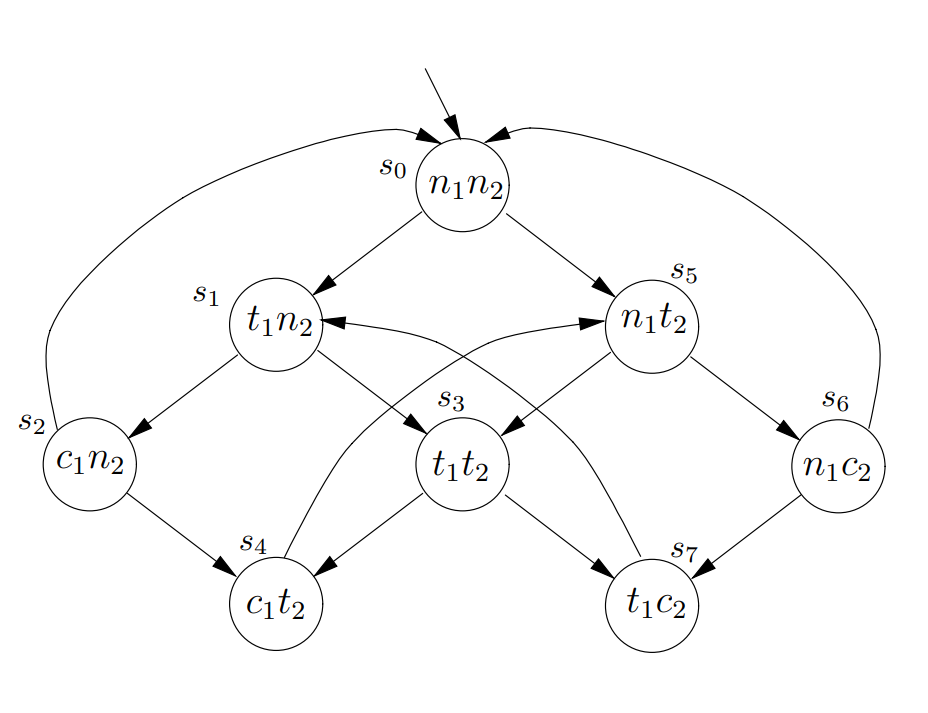

# HW7-lab report
## Task description
We need to use `NuSMV` to solve a mutual exclusion problem with 2 processes, and this problem has 4 constraints:
1. Safety: only one process is in its critical section at any time;
2. Liveness: whenever any process requests to enter its critical section, it will eventually be permitted to do so;
3. Non-blocking: a process can always request to enter its critical section;
4. No strict sequencing: processes need not enter their critical section in strict sequence.
On Page 11 of [5.1.4f ppt](http://staff.ustc.edu.cn/~huangwc/fm/5.1.4f.pdf), we see a first attempt model for this mutual exclusion problem:

And our task is to describe this model and 4 constraints using `NuSMV`, to check if this model satisfies 4 constraints.
## Code design
My code includes two parts: first describe the model, then describe the 4 constraints in `LTL` and `CTL` syntax.
### Describe the model
Use a `MODULE` to describe one process's status graph:
```python
MODULE prc(other-st)
	VAR
        st : {n, t, c};
    ASSIGN
        init(st) := n;
        next(st) :=
            case
                (st = n) : {t,n};
                (st = t) & (other-st != c) : c;
                (st = c) : {c,n};
                -- other process may starve, so add FAIRNESS constraint
                -- default:
                TRUE : st;
            esac;
    FAIRNESS running
    FAIRNESS !(st = c)
```
For every process, it has 3 status: `n`, `t`, and `c`.
* `n` means it is in its non-critical state
* `t` means it is trying to enter its critical state
* `c` means it is in its critical state
If the other process is not in critical state, and the current process is trying to enter its critical state, then it has opportunity to go from state `t` to state `c`.
```python
(st = c) : {c,n};
```
The above sentence may cause the other process to starve, so add `FAIRNESS` global constraint later:
```python
FAIRNESS !(st = c)
```
which is equivalent to `GF!(st = c)` and means in the future, the current process will always exit its critical state and let the other process go into critical state.
### Describe the constraints
1. `Safety`
```python
LTLSPEC G!((pr1.st = c) & (pr2.st = c))
```
It means $process_1$ and $process_2$ won't go into critical state at the same time.
2. `Liveness`
```python
LTLSPEC G((pr1.st = t) -> F(pr1.st = c))
LTLSPEC G((pr2.st = t) -> F(pr2.st = c))
```
It means if $process_1$ is trying to enter critical state, it will always success in the future, and the same for $process_2$.
3. `Non-blocking`
```python
CTLSPEC AG((pr1.st = n) -> EX(pr1.st = t))
CTLSPEC AG((pr2.st = n) -> EX(pr2.st = t))
```
It means for every status satisfying $n_1$, there exists a path where the successor satisfying $t_1$.
4. `No strict sequencing`
```python
CTLSPEC EG((pr1.st = c) -> E[(!(pr1.st = c) & !(pr2.st = c))U(pr1.st = c)])
CTLSPEC EG((pr2.st = c) -> E[(!(pr1.st = c) & !(pr2.st = c))U(pr2.st = c)])
```
Strict sequencing means the 2 processes always enter their critical state in the following order:
$process_1\to process_2\to process_1\to process_2\to...$
So, if we want to check no strict sequencing, we just need to find whether there is a path satisfying:
$process_1\to process1\to...$ and $process_2\to process_2\to...$
That is to say, there exists a path with two distinct states satisfying $c_1$ such that no state in between them satisfies $c_1$ or $c_2$.
**NOTICE** that `CTLSPEC` only supports `U` in the format: 
$E[ctl\_expr\ U\ ctl\_expr]$.
## Running results
Running command:
```bash
NuSMV first-attempt-CTL.smv
```
And the results:
1. Specification for `Safety`, `Liveness` and `No strict sequencing` is true:
```bash
-- specification AG (pr1.st = n -> EX pr1.st = t)  is true
-- specification AG (pr2.st = n -> EX pr2.st = t)  is true
-- specification EG (pr1.st = c -> E [ (!(pr1.st = c) & !(pr2.st = c)) U pr1.st = c ] )  is true
-- specification EG (pr2.st = c -> E [ (!(pr1.st = c) & !(pr2.st = c)) U pr2.st = c ] )  is true
-- specification  G !(pr1.st = c & pr2.st = c)  is true
```
2. Specification for `Non-blocking` is false, and see the counter example for $process_1$:
```bash
-- specification  G (pr1.st = t ->  F pr1.st = c)  is false
-- as demonstrated by the following execution sequence
Trace Description: LTL Counterexample 
Trace Type: Counterexample 
  -> State: 1.1 <-
    pr1.st = n
    pr2.st = n
  -> Input: 1.2 <-
    _process_selector_ = pr1
    running = FALSE
    pr2.running = FALSE
    pr1.running = TRUE
  -- Loop starts here
  -> State: 1.2 <-
    pr1.st = t
  -> Input: 1.3 <-
    _process_selector_ = pr2
    pr2.running = TRUE
    pr1.running = FALSE
  -> State: 1.3 <-
    pr2.st = t
  -> Input: 1.4 <-
  -> State: 1.4 <-
    pr2.st = c
  -> Input: 1.5 <-
  -- Loop starts here
  -> State: 1.5 <-
    pr2.st = n
  -> Input: 1.6 <-
  -> State: 1.6 <-
    pr2.st = t
  -> Input: 1.7 <-
  -> State: 1.7 <-
    pr2.st = c
  -> Input: 1.8 <-
  -- Loop starts here
  -> State: 1.8 <-
    pr2.st = n
  -> Input: 1.9 <-
  -> State: 1.9 <-
    pr2.st = t
  -> Input: 1.10 <-
  -> State: 1.10 <-
    pr2.st = c
  -> Input: 1.11 <-
    _process_selector_ = pr1
    pr2.running = FALSE
    pr1.running = TRUE
  -> State: 1.11 <-
  -> Input: 1.12 <-
    _process_selector_ = pr2
    pr2.running = TRUE
    pr1.running = FALSE
  -- Loop starts here
  -> State: 1.12 <-
    pr2.st = n
  -> Input: 1.13 <-
  -> State: 1.13 <-
    pr2.st = t
  -> Input: 1.14 <-
  -> State: 1.14 <-
    pr2.st = c
  -> Input: 1.15 <-
  -> State: 1.15 <-
    pr2.st = n
```
The above counter example means the following status transition:
$n_1n_2\to t_1n_2\to t_1t_2\to t_1c_2\to t_1n_2\to t_1t_2\to t_1c_2\to t_1n_2\to t_1t_2\to t_1c_2\to t_1n_2\to...$
So in this path, $process_1$ will never have opportunity to enter its critical state.

Then see the counter example for $process_2$:
```bash
-- specification  G (pr2.st = t ->  F pr2.st = c)  is false
-- as demonstrated by the following execution sequence
Trace Description: LTL Counterexample 
Trace Type: Counterexample 
  -> State: 2.1 <-
    pr1.st = n
    pr2.st = n
  -> Input: 2.2 <-
    _process_selector_ = pr1
    running = FALSE
    pr2.running = FALSE
    pr1.running = TRUE
  -> State: 2.2 <-
    pr1.st = t
  -> Input: 2.3 <-
    _process_selector_ = pr2
    pr2.running = TRUE
    pr1.running = FALSE
  -- Loop starts here
  -> State: 2.3 <-
    pr2.st = t
  -> Input: 2.4 <-
    _process_selector_ = main
    running = TRUE
    pr2.running = FALSE
  -- Loop starts here
  -> State: 2.4 <-
  -> Input: 2.5 <-
  -- Loop starts here
  -> State: 2.5 <-
  -> Input: 2.6 <-
  -- Loop starts here
  -> State: 2.6 <-
  -> Input: 2.7 <-
    _process_selector_ = pr1
    running = FALSE
    pr1.running = TRUE
  -> State: 2.7 <-
    pr1.st = c
  -> Input: 2.8 <-
  -> State: 2.8 <-
    pr1.st = n
  -> Input: 2.9 <-
    _process_selector_ = main
    running = TRUE
    pr1.running = FALSE
  -> State: 2.9 <-
  -> Input: 2.10 <-
    _process_selector_ = pr1
    running = FALSE
    pr1.running = TRUE
  -- Loop starts here
  -> State: 2.10 <-
    pr1.st = t
  -> Input: 2.11 <-
  -> State: 2.11 <-
    pr1.st = c
  -> Input: 2.12 <-
    _process_selector_ = pr2
    pr2.running = TRUE
    pr1.running = FALSE
  -> State: 2.12 <-
  -> Input: 2.13 <-
    _process_selector_ = pr1
    pr2.running = FALSE
    pr1.running = TRUE
  -> State: 2.13 <-
    pr1.st = n
  -> Input: 2.14 <-
  -> State: 2.14 <-
    pr1.st = t
```
The above counter example means the following status transition:
$n_1n_2\to t_1n_2\to t_1t_2\to c_1t_2\to n_1t_2\to t_1t_2\to c_1t_2\to n_1t_2\to t_1t_2\to...$
So in this path, $process_2$ will never have opportunity to enter its critical state.
## Appendix: source code
```python
-- safety: only one process is in its critical section
-- liveness: whenever any process requests to enter its
--          critical section, it will eventually be
--          permitted to do so.
-- non-blocking: a process can always request to enter
--          its critical section.
-- no strict sequencing: processes need not enter their
--          critical section in strict sequence
MODULE prc(other-st)
    VAR
        st : {n, t, c};
        -- n: in its non-critical state
        -- t: trying to enter its critical state
        -- c: in its critical state
    ASSIGN
        init(st) := n;
        next(st) :=
            case
                (st = n) : {t,n};
                (st = t) & (other-st != c) : c;
                (st = c) : {c,n};
                -- other process may starve, so add FAIRNESS constraint
                -- default:
                TRUE : st;
            esac;
    FAIRNESS running
    FAIRNESS !(st = c)
  
MODULE main
    VAR
        pr1 : process prc(pr2.st);
        pr2 : process prc(pr1.st);
        -- there are 2 processes defined by above module prc()
    -- safety
    LTLSPEC G!((pr1.st = c) & (pr2.st = c))
    -- liveness
    LTLSPEC G((pr1.st = t) -> F(pr1.st = c))
    LTLSPEC G((pr2.st = t) -> F(pr2.st = c))
    -- non-blocking
    CTLSPEC AG((pr1.st = n) -> EX(pr1.st = t))
    CTLSPEC AG((pr2.st = n) -> EX(pr2.st = t))
    -- no strict sequencing
    CTLSPEC EG((pr1.st = c) -> E[(!(pr1.st = c) & !(pr2.st = c))U(pr1.st = c)])
    CTLSPEC EG((pr2.st = c) -> E[(!(pr1.st = c) & !(pr2.st = c))U(pr2.st = c)])
```